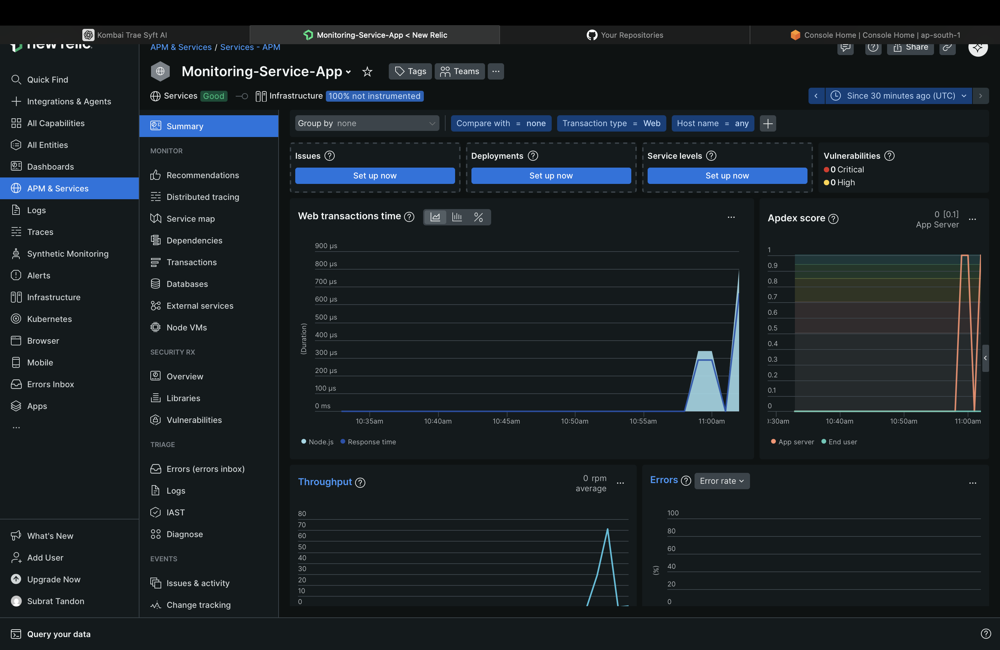

# Monitoring Project

A professional monitoring solution leveraging New Relic for application performance and reliability.

## Technologies Used

- **Node.js**
- **New Relic**
- **Express.js**
- **Docker**
- **Git**

## Setup

### 1. Clone the Repository

```bash
git clone https://github.com/yourusername/monitoring-project.git
cd monitoring-project
```

### 2. Install Dependencies

```bash
npm install
```

### 3. Configure New Relic

Create a `newrelic.js` file in the root directory:

```js
'use strict';
exports.config = {
    app_name: ['Monitoring Project'],
    license_key: 'YOUR_NEW_RELIC_LICENSE_KEY',
    logging: {
        level: 'info'
    },
    allow_all_headers: true,
    attributes: {
        enabled: true
    }
};
```

### 4. Start the Application

```bash
npm start
```

## Visuals

### Service Map


### Summary



### Docker Setup


## Future Scope

- **Integration with Prometheus and Grafana**
- **Automated alerting and incident management**
- **Support for microservices architecture**
- **Advanced analytics and reporting**
- **Cloud-native deployment (Kubernetes, AWS, Azure)**

## Contributing

Feel free to open issues or submit pull requests for improvements.

---

**Maintainer:** Subrat Tandon  
**Contact:** subratop1105@gmail.com